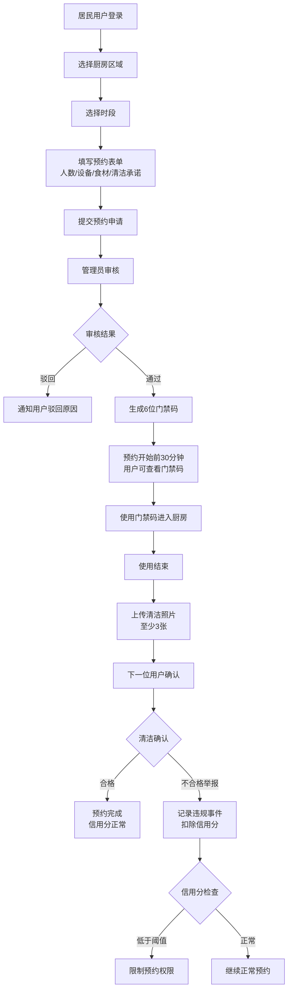

## 1. 产品概述

社区共享厨房时段管理系统是面向居民社区的共享厨房预约与管理平台，解决社区居民对公共厨房空间高效、有序使用的需求。通过预约申请、管理员审核、门禁码授权、清洁确认闭环流程，保障共享厨房规范使用，同时通过违规记录机制约束用户行为，提升社区公共资源利用效率。

## 2. 核心功能

### 2.1 用户角色

| 角色 | 注册方式 | 核心权限 |
|------|---------|---------|
| 居民用户 | 手机号注册/账号登录 | 浏览时段、提交预约申请、查看门禁码、上传清洁照片、确认上一位用户清洁状态、查看个人违规记录 |
| 管理员 | 专用管理员账号 | 审核预约申请、生成门禁码、查看所有预约记录、管理违规记录、查看厨房使用统计 |

### 2.2 功能模块

1. **首页/仪表盘**：厨房空间概览、今日预约、快速入口、个人状态
2. **时段预约页**：厨房区域选择（烘焙间/蒸煮间/清洗区）、日历时段选择、预约表单（人数/设备/食材/清洁承诺）
3. **预约管理页**：我的预约列表、预约详情、状态追踪
4. **管理员审核页**：待审核列表、审核操作（通过/驳回）、生成门禁码
5. **门禁码展示页**：动态门禁码显示、有效期、使用说明
6. **清洁确认页**：上传清洁照片、下一位用户确认清洁状态
7. **违规记录页**：违规记录列表、违规详情、权限状态提示

### 2.3 页面详情

| 页面名称 | 模块名称 | 功能描述 |
|---------|---------|---------|
| 首页/仪表盘 | 厨房状态卡片 | 显示三个厨房区域（烘焙间/蒸煮间/清洗区）实时状态及当日预约数 |
| 首页/仪表盘 | 今日日程时间轴 | 展示当日已排程的预约时间线 |
| 首页/仪表盘 | 快捷操作区 | 快速预约、查看我的预约、违规记录（若有）等入口 |
| 时段预约页 | 区域选择器 | 三选一卡片式选择，显示区域介绍和设备清单 |
| 时段预约页 | 日历时段网格 | 显示7天内可选时段，已预约时段标灰禁用 |
| 时段预约页 | 预约信息表单 | 人数输入、设备多选、食材填写、清洁承诺勾选、备注 |
| 预约管理页 | 状态筛选标签 | 全部/待审核/已通过/使用中/待清洁确认/已完成/已驳回 |
| 预约管理页 | 预约卡片列表 | 显示预约核心信息、状态徽章、操作按钮 |
| 管理员审核页 | 待审核列表 | 显示待审核预约详情卡片，包含申请人信息和预约内容 |
| 管理员审核页 | 审核操作面板 | 通过（生成门禁码）/驳回（填写原因）操作 |
| 门禁码展示页 | 动态门禁码 | 大号数字显示、倒计时刷新、防伪二维码 |
| 门禁码展示页 | 使用说明 | 门禁位置、有效时间范围、注意事项 |
| 清洁确认页 | 照片上传区 | 多图上传（最少3张：台面/地面/设备）、预览删除 |
| 清洁确认页 | 确认面板 | 下一位用户查看照片、确认/举报清洁不合格 |
| 违规记录页 | 记录时间线 | 按时间倒序显示违规事件、类型、扣分、处理状态 |
| 违规记录页 | 权限状态指示器 | 当前信用分、预约权限等级、恢复提示 |

## 3. 核心流程

居民用户选择厨房区域和可用时段，填写预约信息（人数、设备、食材、清洁承诺）后提交申请。管理员在审核列表中查看预约详情，审核通过后系统自动生成6位数字门禁码，用户可在预约开始前30分钟查看门禁码。用户使用门禁码进入厨房使用，使用结束后需上传至少3张清洁照片。下一位预约用户到达时需先确认上一位用户的清洁状态。若清洁不合格被举报或超时未上传照片，系统记录违规事件并扣除信用分，信用分低于阈值将限制或暂停预约权限，经学习或申诉后可恢复。

## 4. 用户界面设计

### 4.1 设计风格

**设计理念**：温暖自然的社区感 + 现代高效的管理工具

- **主色调**：橄榄绿 `#5A7247` — 象征自然、健康、社区和谐
- **辅助色**：暖陶土橙 `#D97757` — 突出行动按钮和重要提示
- **背景色**：米白色 `#FAF7F2` — 温暖不刺眼，符合厨房空间氛围
- **状态色**：
  - 待审核：琥珀黄 `#F59E0B`
  - 已通过：翠绿 `#10B981`
  - 已驳回：玫红 `#E11D48`
  - 使用中：靛蓝 `#4F46E5`
- **按钮风格**：圆角矩形（12px），主按钮实心填充配白色文字，次按钮描边配深色文字，悬停有微上浮效果
- **字体**：标题使用「思源宋体/Noto Serif SC」体现温暖质感，正文使用「思源黑体/Noto Sans SC」保证可读性
- **布局风格**：卡片式布局，柔和阴影，充足留白，顶部固定导航栏
- **图标风格**：线性图标（Lucide风格），统一2px描边，圆角端点，配合轻微emoji点缀

### 4.2 页面设计概述

| 页面名称 | 模块名称 | UI元素 |
|---------|---------|--------|
| 首页/仪表盘 | 厨房状态卡片 | 大图标+状态色块+数字展示，悬停轻微放大，渐变背景 |
| 首页/仪表盘 | 今日日程时间轴 | 垂直时间轴，左侧时间右侧卡片，当前时间线高亮指示 |
| 时段预约页 | 区域选择器 | 三列等宽卡片，选中态橙色边框+背景高亮，区域照片+设备图标列表 |
| 时段预约页 | 日历时段网格 | 横向日期选择器 + 纵向时段（每30分钟一格），可用时段点击选择，已预约灰显 |
| 预约管理页 | 状态筛选标签 | 横向滚动标签栏，选中态实心填充，未选中态浅色描边 |
| 门禁码展示页 | 动态门禁码 | 超大6位等宽数字，逐位淡入动画，边框呼吸灯效果，二维码居中 |
| 清洁确认页 | 照片上传区 | 虚线框拖拽区，缩略图网格排列，删除角标，进度指示 |
| 违规记录页 | 记录时间线 | 左侧违规类型色标，右侧详情卡片，信用分仪表盘环形进度条 |

### 4.3 响应式

- **设计优先级**：桌面端优先（1280px及以上），适配平板（768px）和移动端（375px）
- **导航栏**：桌面端水平导航，移动端折叠为汉堡菜单抽屉
- **卡片网格**：桌面端3列 → 平板端2列 → 移动端1列
- **时段网格**：桌面端横向滚动时段表，移动端纵向列表
- **表单**：桌面端多列并排，移动端单列堆叠
- **触控优化**：移动端可点击区域不小于44×44px，增加按钮间距

### 4.4 动效与交互

- 页面加载：元素淡入 + 轻微上移，staggered延迟（50ms间隔）
- 卡片悬停：translateY(-4px) + 阴影加深，过渡300ms cubic-bezier(0.4,0,0.2,1)
- 按钮点击：scale(0.97) 回弹效果
- 状态变更：徽章颜色渐变过渡，配合轻微脉冲动画
- 门禁码：每30秒刷新时数字翻转效果，边框呼吸光晕
- 清洁照片上传：缩略图从底部滑入 + 渐显
