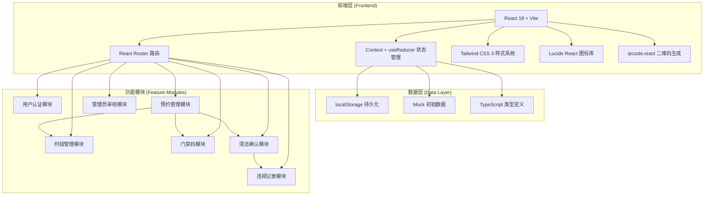
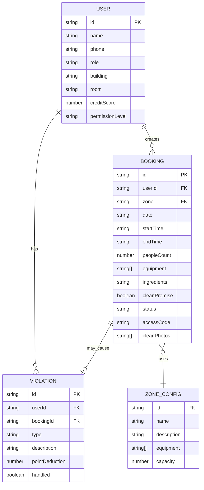

## 1. 架构设计



## 2. 技术描述

- **前端框架**：React@18 + TypeScript@5 — 类型安全的组件化开发
- **构建工具**：Vite@5 — 极速开发体验与热更新
- **路由管理**：React Router DOM@6 — 声明式SPA路由
- **样式方案**：Tailwind CSS@3 — 原子化CSS，配合自定义主题变量
- **状态管理**：React Context + useReducer — 轻量级全局状态，无需额外依赖
- **图标库**：Lucide React — 现代线性风格图标，符合设计规范
- **二维码**：qrcode.react — 门禁码防伪二维码生成
- **数据持久化**：localStorage API — 模拟后端存储，数据本地持久化
- **Mock数据**：内置JSON格式初始数据 — 覆盖用户、预约、违规等核心场景

## 3. 路由定义

| 路由路径 | 页面名称 | 权限要求 | 功能说明 |
|---------|---------|---------|---------|
| `/` | 首页/仪表盘 | 居民/管理员 | 厨房状态概览、今日预约、快捷操作 |
| `/login` | 登录页 | 公开 | 角色切换登录（居民/管理员） |
| `/booking` | 时段预约页 | 居民 | 选择区域、时段，填写预约表单 |
| `/my-bookings` | 我的预约页 | 居民 | 个人预约列表、状态追踪、操作入口 |
| `/my-bookings/:id` | 预约详情页 | 居民 | 预约详情、门禁码入口、上传清洁照片 |
| `/access-code/:id` | 门禁码展示页 | 居民 | 6位动态门禁码、二维码、使用说明 |
| `/clean-confirm/:id` | 清洁确认页 | 居民 | 下一位用户确认上一位清洁状态 |
| `/violations` | 违规记录页 | 居民 | 个人违规记录、信用分、权限状态 |
| `/admin/review` | 管理员审核页 | 管理员 | 待审核预约列表、审核操作 |
| `/admin/bookings` | 管理员预约总览 | 管理员 | 全部预约记录、统计视图 |
| `/admin/violations` | 管理员违规管理 | 管理员 | 违规记录管理、申诉处理 |

## 4. 数据模型与类型定义

### 4.1 核心类型

```typescript
// 用户角色
type UserRole = 'resident' | 'admin';

// 用户信息
interface User {
  id: string;
  name: string;
  phone: string;
  role: UserRole;
  avatar?: string;
  building: string;        // 楼栋号
  room: string;            // 房间号
  creditScore: number;     // 信用分 0-100
  permissionLevel: 'normal' | 'restricted' | 'suspended';
  createdAt: string;
}

// 厨房区域类型
type KitchenZone = 'baking' | 'cooking' | 'cleaning';

// 时段状态
type BookingStatus = 
  | 'pending'      // 待审核
  | 'approved'     // 已通过
  | 'rejected'     // 已驳回
  | 'in_use'       // 使用中
  | 'clean_pending'// 待清洁确认
  | 'completed'    // 已完成
  | 'cancelled';   // 已取消

// 预约信息
interface Booking {
  id: string;
  userId: string;
  userName: string;
  zone: KitchenZone;
  date: string;           // YYYY-MM-DD
  startTime: string;      // HH:mm
  endTime: string;        // HH:mm
  peopleCount: number;
  equipment: string[];    // 选择的设备
  ingredients: string;    // 食材说明
  cleanPromise: boolean;  // 清洁承诺
  remarks?: string;
  status: BookingStatus;
  rejectReason?: string;
  accessCode?: string;    // 6位门禁码
  accessCodeGeneratedAt?: string;
  cleanPhotos?: string[]; // 清洁照片（Base64）
  cleanConfirmedBy?: string;    // 清洁确认人ID
  cleanConfirmedAt?: string;
  cleanReportReason?: string;    // 举报原因
  createdAt: string;
  updatedAt: string;
}

// 违规类型
type ViolationType = 
  | 'unclean'           // 清洁不合格
  | 'no_clean_photo'    // 未上传清洁照片
  | 'overtime'          // 超时使用
  | 'equipment_damage'  // 设备损坏
  | 'no_show'           // 预约未使用
  | 'other';            // 其他

// 违规记录
interface Violation {
  id: string;
  userId: string;
  userName: string;
  bookingId?: string;
  type: ViolationType;
  description: string;
  pointDeduction: number;   // 扣除信用分
  reportedBy?: string;      // 举报人
  createdAt: string;
  handled: boolean;         // 是否处理完毕
  appealStatus?: 'none' | 'pending' | 'approved' | 'rejected';
}

// 厨房区域配置
interface ZoneConfig {
  id: KitchenZone;
  name: string;
  description: string;
  equipment: string[];
  capacity: number;         // 最大容纳人数
  icon: string;
}

// 时段配置
interface TimeSlot {
  time: string;       // HH:mm
  label: string;
}
```

### 4.2 数据结构ER图



## 5. 目录结构

```
src/
├── assets/              # 静态资源（图片、字体）
├── components/          # 通用组件
│   ├── layout/         # 布局组件（Header、Sidebar、Container）
│   ├── ui/             # 基础UI（Button、Card、Badge、Modal等）
│   └── features/       # 业务组件（BookingCard、TimeSlotGrid等）
├── context/            # React Context状态管理
│   ├── AuthContext.tsx
│   ├── BookingContext.tsx
│   └── AppContext.tsx
├── hooks/              # 自定义Hooks
│   ├── useAuth.ts
│   ├── useBooking.ts
│   └── useCredit.ts
├── pages/              # 页面组件
│   ├── Dashboard.tsx
│   ├── Login.tsx
│   ├── BookingPage.tsx
│   ├── MyBookings.tsx
│   ├── BookingDetail.tsx
│   ├── AccessCode.tsx
│   ├── CleanConfirm.tsx
│   ├── Violations.tsx
│   └── admin/
│       ├── ReviewPage.tsx
│       ├── AdminBookings.tsx
│       └── AdminViolations.tsx
├── router/             # 路由配置
│   └── index.tsx
├── types/              # TypeScript类型定义
│   └── index.ts
├── data/               # Mock数据
│   ├── zones.ts
│   ├── users.ts
│   ├── bookings.ts
│   └── violations.ts
├── utils/              # 工具函数
│   ├── storage.ts      # localStorage封装
│   ├── codeGenerator.ts # 门禁码生成
│   ├── dateTime.ts     # 日期时间处理
│   └── credit.ts       # 信用分计算
├── App.tsx
├── main.tsx
└── index.css
```

## 6. 状态管理设计

### 全局状态分层：

1. **AuthContext** - 认证与用户信息
   - currentUser: User | null
   - login(), logout(), switchRole()

2. **BookingContext** - 预约与业务数据
   - bookings: Booking[]
   - violations: Violation[]
   - createBooking(), updateBookingStatus()
   - generateAccessCode(), uploadCleanPhotos()
   - confirmCleanliness(), addViolation()

3. **AppContext** - 应用配置
   - theme, notifications, loading状态

### 数据持久化策略：
- 所有Context状态变更时自动同步至localStorage
- 初始化时从localStorage读取，无数据则加载Mock初始数据
- 关键操作（门禁码生成、违规记录）写入时间戳防篡改
